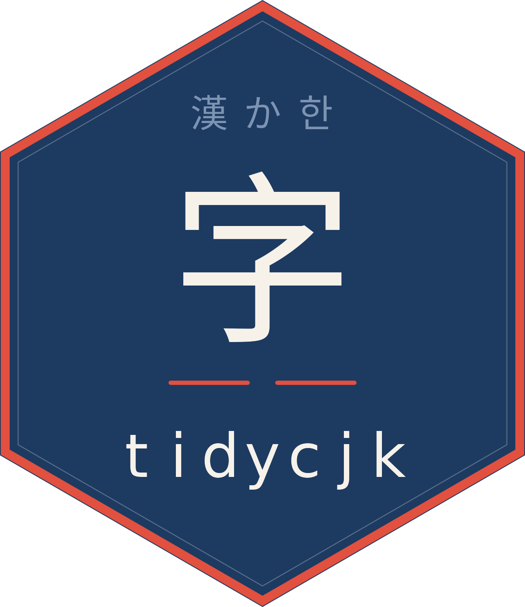
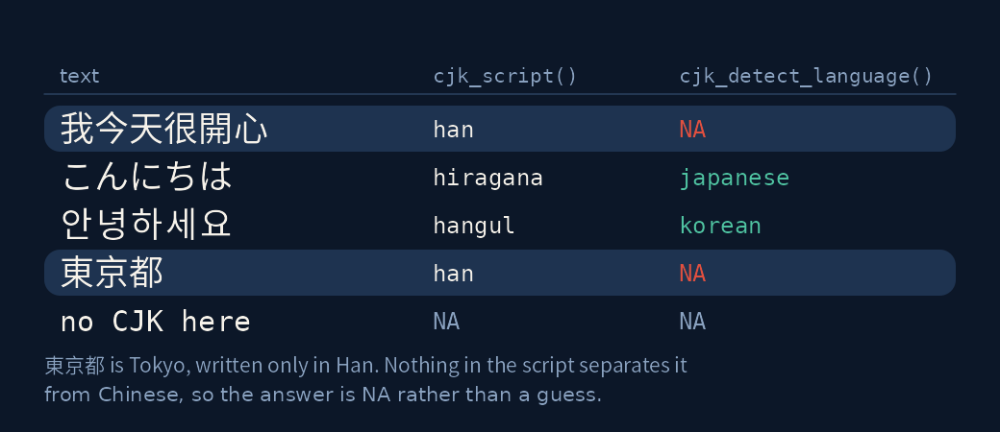
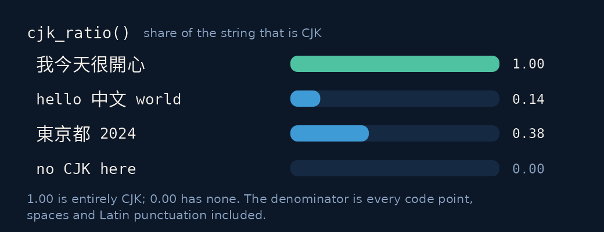
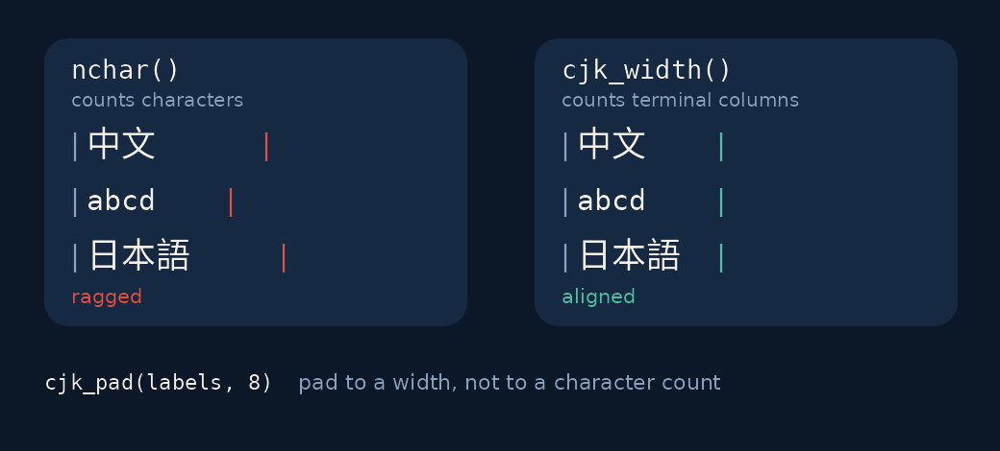
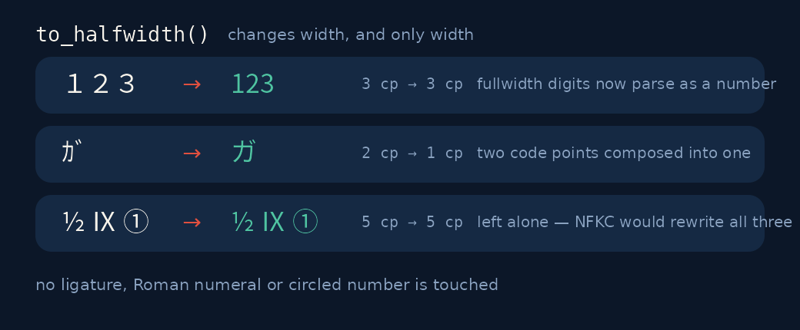

<!-- README.md is generated from README.Rmd. Please edit that file -->

```{r, include = FALSE}
knitr::opts_chunk$set(
  collapse = TRUE,
  comment = "#>",
  fig.path = "man/figures/README-",
  out.width = "100%"
)
```

# tidycjk 

<!-- badges: start -->
[](https://lifecycle.r-lib.org/articles/stages.html#stable)
[](https://CRAN.R-project.org/package=tidycjk)
[](https://github.com/PursuitOfDataScience/tidycjk/actions/workflows/R-CMD-check.yaml)
<!-- badges: end -->

Tidy tools for Chinese, Japanese and Korean text. R's text tooling assumes
words are separated by whitespace; CJK writing does not oblige.



## Installation

```r
install.packages("tidycjk")
```

## What you get

|  |  |
|---|---|
| **Detect** | `has_cjk()` · `cjk_script()` · `cjk_detect_language()` · `cjk_ratio()` |
| **Measure** | `cjk_width()` · `cjk_char_counts()` · `cjk_summary()` |
| **Lay out** | `cjk_pad()` · `cjk_truncate()` · `cjk_wrap()` |
| **Normalise** | `to_halfwidth()` · `to_fullwidth()` |
| **Segment** | `cjk_tokens()` · `cjk_segment()` · `cjk_segmenters()` · `register_cjk_segmenter()` |
| **NLP prep** | `cjk_sentences()` · `cjk_ngrams()` |
| **Order** | `cjk_sort()` · `cjk_order()` |
| **Transliterate** | `cjk_romanize()` · `cjk_simplify()` · `cjk_traditionalize()` |
| **Kana & jamo** | `to_hiragana()` · `to_katakana()` · `cjk_jamo()` · `cjk_compose_jamo()` |

Most verbs take a character vector, are vectorised and propagate `NA`.
Three — `cjk_summary()`, `cjk_char_counts()` and `cjk_tokens()` — take
`(data, column)` instead and return a tibble straight into a
[dplyr](https://CRAN.R-project.org/package=dplyr) pipeline.

## Which script, which language?



```{r language}
library(tidycjk)

cjk_detect_language(c("こんにちは", "안녕하세요", "東京都"))
```

東京都 is Tokyo — Japanese — but it is written entirely in Han characters, and
nothing in the script separates it from Chinese. Anything that answers
`"chinese"` there is guessing. Ask for the guess explicitly if you want it:

```{r language-optin}
cjk_detect_language("東京都", han_only = "chinese")
```

## How much of this is CJK?



```{r summary}
posts <- data.frame(
  id = 1:3,
  text = c("我今天很開心", "hello 中文 world", "no CJK here")
)

cjk_summary(posts, text)
```

`prop_with_cjk` answers "how many of these rows are CJK at all"; `mean_ratio`
answers "how CJK are they".

## Width, not character count



```{r width}
labels <- c("中文", "abcd", "日本語")

nchar(labels)      # all look comparable
cjk_width(labels)  # they are not

cat(paste0("|", cjk_pad(labels, 8), "|"), sep = "\n")
```

## Fullwidth and halfwidth



The usual advice is `NFKC`, which fixes width and also rewrites ligatures,
Roman numerals and circled numbers. `to_halfwidth()` changes width and nothing
else.

```{r normalize}
as.numeric(to_halfwidth("１２３"))

nchar("ｶﾞ")                 # U+FF76 U+FF9E, two code points
to_halfwidth("ｶﾞ") == "ガ"   # composed into one
```

## Segmentation

Where a word ends is a fact about a language, not about Unicode. `"icu"` is a
real word segmenter — ICU's dictionary-based break iterators, which ship
inside stringi, so it costs no dependency you do not already have:

```{r segment}
cjk_segment("我今天很開心", engine = "icu")
```

Words, not characters. `"character"` is the dictionary-free baseline, and the
contrast is what a segmenter is for:

```{r segment-char}
cjk_segment("我今天很開心", engine = "character")
```

`engine` has no default, because `"character"` answers a different question
and would otherwise be the answer you got by accident. (`locale` is accepted
but does not pick the dictionary — ICU segments Han and kana by script, not
by locale.) Register
[gibasa](https://CRAN.R-project.org/package=gibasa) or jiebaR the same way —
see `vignette("segmentation")`.

## Romanise and convert

```{r translit}
cjk_romanize("中文")        # pinyin
cjk_simplify("漢字")        # traditional -> simplified
to_hiragana("カタカナ")
cjk_jamo("한")              # Hangul syllable -> jamo
```

These differ in how far you can trust them, and
`vignette("transliteration")` is explicit about each. Kana conversion is a
normalisation — run it one way, since converting mixed text to one syllabary
erases a distinction that carries meaning. The jamo round trip returns NFC.
Han conversion resolves ambiguous characters from context, and gets them
right, but does not substitute regional vocabulary. Romanisation reads every
Han character as Chinese, so it is pinyin even for Japanese kanji.

## Sentences and n-grams

```{r nlp}
cjk_sentences("我今天很開心。你呢？")

cjk_ngrams("中文很好")   # character bigrams: the dictionary-free baseline
```

Sorting is its own trap. `sort()` on Chinese gives code point order — which
is radical order, not phonetic order, and so not what sorting a column of
names calls for:

```{r sort}
x <- c("張", "王", "李")   # Zhang, Wang, Li
sort(x)                    # code point order
cjk_sort(x, locale = "zh") # pinyin: Li, Wang, Zhang
```

`cjk_blocks()` exports the block table the whole package is built on, so the
definition of "CJK" can be read rather than guessed at.

## Learn more

`vignette("tidycjk")` · `vignette("segmentation")` ·
`vignette("width-and-layout")` · `vignette("transliteration")`

## Related work

| Need | Use |
|---|---|
| Display width, width-aware padding | [stringi](https://CRAN.R-project.org/package=stringi) — `stri_width()` and `stri_pad()`, which `cjk_width()` and `cjk_pad()` wrap |
| Japanese segmentation | [gibasa](https://CRAN.R-project.org/package=gibasa) — a MeCab binding, on CRAN; gives part of speech and lemma, which the `"icu"` engine does not |
| Chinese segmentation | [jiebaR](https://CRAN.R-project.org/package=jiebaR) — archived from CRAN 2025-05-01, so install from source; register it as a `tidycjk` engine |
| Pinyin | [pinyin](https://CRAN.R-project.org/package=pinyin), [hanyupinyin](https://CRAN.R-project.org/package=hanyupinyin) |
| Traditional/simplified | [tmcn](https://CRAN.R-project.org/package=tmcn); [OpenCC](https://github.com/BYVoid/OpenCC) outside R |
| Japanese utilities | [zipangu](https://CRAN.R-project.org/package=zipangu), [Nippon](https://CRAN.R-project.org/package=Nippon) |
