<!-- README.md is generated from README.Rmd. Please edit that file -->

<p align="center"></p>
<h1 align="center">tidycjk</h1>
<p align="center"><b>Chinese, Japanese and Korean text in R: measured in columns, split into words, and kept in tibbles.</b></p>
<!-- badges: start -->
<p align="center">
<a href="https://CRAN.R-project.org/package=tidycjk"></a>
<a href="https://CRAN.R-project.org/package=tidycjk"></a>
<a href="https://github.com/PursuitOfDataScience/tidycjk/actions/workflows/R-CMD-check.yaml"></a>
<a href="https://lifecycle.r-lib.org/articles/stages.html#stable"></a>
</p>
<!-- badges: end -->



## 📦 Install

1.  `install.packages("tidycjk")`
2.  `library(tidycjk)`
3.  `cjk_width("中文")` prints `4`: two characters, four terminal
    columns.

## ✨ What you get

| Task | Verbs |
|----|----|
| Detect | `has_cjk()` · `cjk_script()` · `cjk_detect_language()` · `cjk_ratio()` |
| Lay out | `cjk_width()` · `cjk_pad()` · `cjk_truncate()` · `cjk_wrap()` |
| Segment | `cjk_segment()` · `cjk_tokens()` · `cjk_sentences()` · `cjk_ngrams()` |
| Clean | `to_halfwidth()` · `to_fullwidth()` · `cjk_normalize()` · `cjk_strip_punct()` |
| Convert | `cjk_romanize()` · `cjk_simplify()` · `cjk_traditionalize()` · `to_hiragana()` · `to_katakana()` · `cjk_jamo()` · `cjk_compose_jamo()` |
| Summarise, sort | `cjk_summary()` · `cjk_char_counts()` · `cjk_sort()` · `cjk_order()` · `cjk_blocks()` |

Every verb is vectorised and keeps `NA`; the three that take
`(data, column)` return a tibble for a dplyr pipeline.

## 🔍 Examples

``` r
cjk_detect_language(c("こんにちは", "안녕하세요", "東京都"))
#> [1] "japanese" "korean"   NA
cjk_segment("我今天很開心", engine = "icu")
#> [[1]]
#> [1] "我"   "今天" "很"   "開心"
cjk_pad(c("中文", "abcd"), 6)
#> [1] "中文  " "abcd  "
cjk_sort(c("張", "王", "李"), locale = "zh")
#> [1] "李" "王" "張"
cjk_summary(data.frame(text = c("我今天很開心", "hello 中文", "no CJK")), text)
#> # A tibble: 1 × 4
#>   n_docs n_with_cjk prop_with_cjk mean_ratio
#>    <int>      <int>         <dbl>      <dbl>
#> 1      3          2         0.667      0.417
```

`東京都` is Tokyo: Japanese written only in Han characters, which no
script test can tell from Chinese, so the answer is `NA` rather than a
guess.

## ⚠️ Gotchas

| Trap | What to do |
|----|----|
| Han-only text has no detectable language | pass `han_only = "chinese"` if you know the corpus |
| `engine` has no default | `"icu"` for words, `"character"` for characters |
| `cjk_romanize()` reads each Han character alone, as Chinese | treat it as a sort key; use gibasa for Japanese readings |
| `sort()` on Han depends on `LC_COLLATE` | `cjk_sort(x, locale = "zh")` |
| Plain NFC rewrites 460 of the 472 compatibility ideographs | keep the original column if the distinction matters |
| A file in GBK, Big5 or Shift_JIS | name it when reading: `read.csv(f, fileEncoding = "GBK")` |

## 📚 Learn more

Four vignettes (`tidycjk`, `segmentation`, `width-and-layout`,
`transliteration`) and a [visual
tour](https://pursuitofdatascience.github.io/tidycjk/articles/gallery.html).
For more than ICU gives:
[gibasa](https://CRAN.R-project.org/package=gibasa) (MeCab, with part of
speech), [udpipe](https://CRAN.R-project.org/package=udpipe) (models for
all three languages), [jiebaR](https://github.com/qinwf/jiebaR)
(archived from CRAN, install from GitHub) and
[OpenCC](https://github.com/BYVoid/OpenCC) (regional vocabulary).
