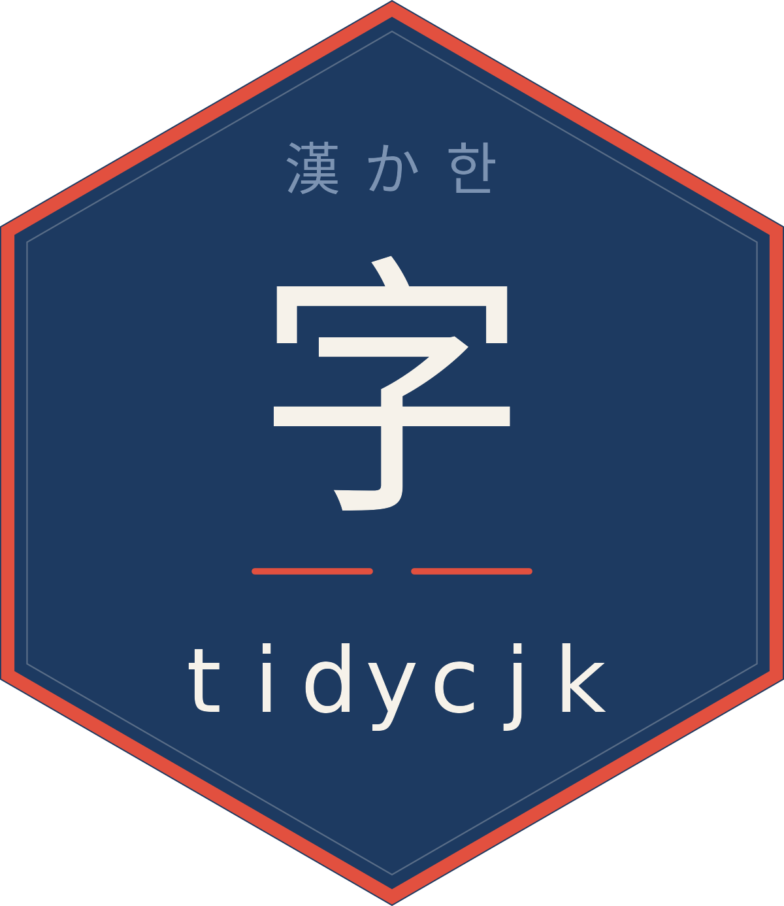

# tidycjk



**Chinese, Japanese and Korean text in R: measured in columns, split
into words, and kept in tibbles.**


## 📦 Install

1.  `install.packages("tidycjk")`
2.  [`library(tidycjk)`](https://pursuitofdatascience.github.io/tidycjk/)
3.  `cjk_width("中文")` prints `4`: two characters, four terminal
    columns.

## ✨ What you get

| Task | Verbs |
|----|----|
| Detect | [`has_cjk()`](https://pursuitofdatascience.github.io/tidycjk/reference/has_cjk.md) · [`cjk_script()`](https://pursuitofdatascience.github.io/tidycjk/reference/cjk_script.md) · [`cjk_detect_language()`](https://pursuitofdatascience.github.io/tidycjk/reference/cjk_detect_language.md) · [`cjk_ratio()`](https://pursuitofdatascience.github.io/tidycjk/reference/cjk_ratio.md) |
| Lay out | [`cjk_width()`](https://pursuitofdatascience.github.io/tidycjk/reference/cjk_width.md) · [`cjk_pad()`](https://pursuitofdatascience.github.io/tidycjk/reference/cjk_pad.md) · [`cjk_truncate()`](https://pursuitofdatascience.github.io/tidycjk/reference/cjk_truncate.md) · [`cjk_wrap()`](https://pursuitofdatascience.github.io/tidycjk/reference/cjk_wrap.md) |
| Segment | [`cjk_segment()`](https://pursuitofdatascience.github.io/tidycjk/reference/cjk_segment.md) · [`cjk_tokens()`](https://pursuitofdatascience.github.io/tidycjk/reference/cjk_tokens.md) · [`cjk_sentences()`](https://pursuitofdatascience.github.io/tidycjk/reference/cjk_sentences.md) · [`cjk_ngrams()`](https://pursuitofdatascience.github.io/tidycjk/reference/cjk_ngrams.md) |
| Clean | [`to_halfwidth()`](https://pursuitofdatascience.github.io/tidycjk/reference/to_halfwidth.md) · [`to_fullwidth()`](https://pursuitofdatascience.github.io/tidycjk/reference/to_halfwidth.md) · [`cjk_normalize()`](https://pursuitofdatascience.github.io/tidycjk/reference/cjk_normalize.md) · [`cjk_strip_punct()`](https://pursuitofdatascience.github.io/tidycjk/reference/cjk_strip_punct.md) |
| Convert | [`cjk_romanize()`](https://pursuitofdatascience.github.io/tidycjk/reference/cjk_romanize.md) · [`cjk_simplify()`](https://pursuitofdatascience.github.io/tidycjk/reference/cjk_simplify.md) · [`cjk_traditionalize()`](https://pursuitofdatascience.github.io/tidycjk/reference/cjk_simplify.md) · [`to_hiragana()`](https://pursuitofdatascience.github.io/tidycjk/reference/to_hiragana.md) · [`to_katakana()`](https://pursuitofdatascience.github.io/tidycjk/reference/to_hiragana.md) · [`cjk_jamo()`](https://pursuitofdatascience.github.io/tidycjk/reference/cjk_jamo.md) · [`cjk_compose_jamo()`](https://pursuitofdatascience.github.io/tidycjk/reference/cjk_jamo.md) |
| Summarise, sort | [`cjk_summary()`](https://pursuitofdatascience.github.io/tidycjk/reference/cjk_summary.md) · [`cjk_char_counts()`](https://pursuitofdatascience.github.io/tidycjk/reference/cjk_char_counts.md) · [`cjk_sort()`](https://pursuitofdatascience.github.io/tidycjk/reference/cjk_sort.md) · [`cjk_order()`](https://pursuitofdatascience.github.io/tidycjk/reference/cjk_sort.md) · [`cjk_blocks()`](https://pursuitofdatascience.github.io/tidycjk/reference/cjk_blocks.md) |

Every verb is vectorised and keeps `NA`; the three that take
`(data, column)` return a tibble for a dplyr pipeline.

## 🔍 Examples

``` r

cjk_detect_language(c("こんにちは", "안녕하세요", "東京都"))
#> [1] "japanese" "korean"   NA
cjk_segment("我今天很開心", engine = "icu")
#> [[1]]
#> [1] "我"   "今天" "很"   "開心"
cjk_pad(c("中文", "abcd"), 6)
#> [1] "中文  " "abcd  "
cjk_sort(c("張", "王", "李"), locale = "zh")
#> [1] "李" "王" "張"
cjk_summary(data.frame(text = c("我今天很開心", "hello 中文", "no CJK")), text)
#> # A tibble: 1 × 4
#>   n_docs n_with_cjk prop_with_cjk mean_ratio
#>    <int>      <int>         <dbl>      <dbl>
#> 1      3          2         0.667      0.417
```

`東京都` is Tokyo: Japanese written only in Han characters, which no
script test can tell from Chinese, so the answer is `NA` rather than a
guess.

## ⚠️ Gotchas

| Trap | What to do |
|----|----|
| Han-only text has no detectable language | pass `han_only = "chinese"` if you know the corpus |
| `engine` has no default | `"icu"` for words, `"character"` for characters |
| [`cjk_romanize()`](https://pursuitofdatascience.github.io/tidycjk/reference/cjk_romanize.md) reads each Han character alone, as Chinese | treat it as a sort key; use gibasa for Japanese readings |
| [`sort()`](https://rdrr.io/r/base/sort.html) on Han depends on `LC_COLLATE` | `cjk_sort(x, locale = "zh")` |
| Plain NFC rewrites 460 of the 472 compatibility ideographs | keep the original column if the distinction matters |
| A file in GBK, Big5 or Shift_JIS | name it when reading: `read.csv(f, fileEncoding = "GBK")` |

## 📚 Learn more

Four vignettes (`tidycjk`, `segmentation`, `width-and-layout`,
`transliteration`) and a [visual
tour](https://pursuitofdatascience.github.io/tidycjk/articles/gallery.html).
For more than ICU gives:
[gibasa](https://CRAN.R-project.org/package=gibasa) (MeCab, with part of
speech), [udpipe](https://CRAN.R-project.org/package=udpipe) (models for
all three languages), [jiebaR](https://github.com/qinwf/jiebaR)
(archived from CRAN, install from GitHub) and
[OpenCC](https://github.com/BYVoid/OpenCC) (regional vocabulary).
